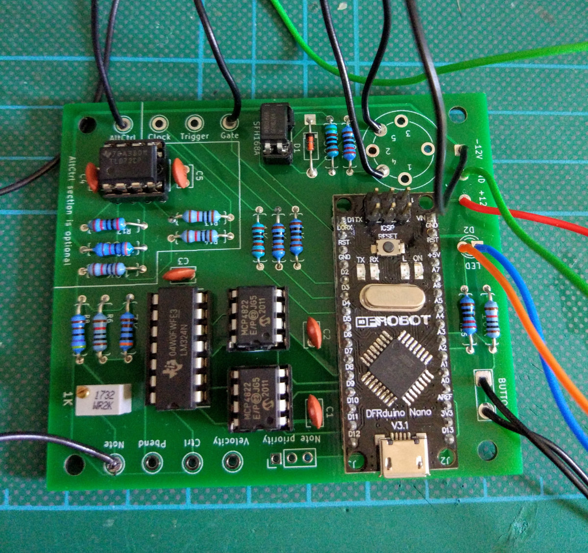
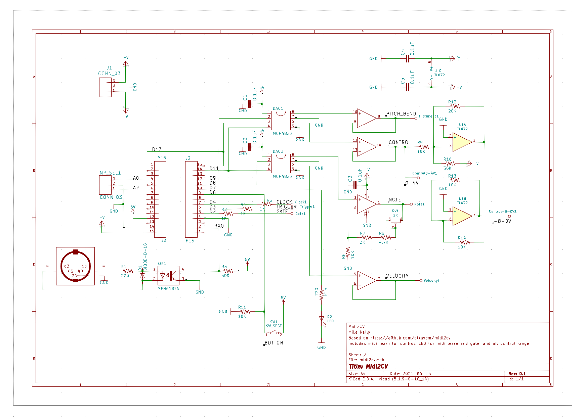

# midi2cv

This project is a fork of [Elkayem](https://github.com/elkayem/midi2cv)'s DIY MIDI to CV converter. It adds the following features:

* Alt Control out, which outputs an alternative voltage range to the Control Change output. The range is configurable depending on the components you use.
* Midi learn feature for Control Change
* LED to show gate events and midi learn status
* Trimpot for fine tuning
* Schematic in **Kicad** format rather than Eagle

#### Alt Control
A dual op amp circuit was added onto to the Control Change CV output signal. This allows you to output an alternative voltage range at Alt Ctrl to the original Control Change out, which is 0 - 4V.
In the schematic this is set up to output -8 - 0V. This can be changed by using different resistor values at `R9, R10, R12, R13 and R14`.
Note that you can also adjust the Arduino code to alter Control Change output, but not in the negative range. 
The Alt Control section of the circuit is optional. The rest of the circuit will function fine without it. If you don't need it, leave out:

* `U1`
* `R9, R10, R12, R13, R14`

and **don't connect the -12V input**. This means that without the Alt Ctrl section you can use a single rail power supply.

#### Midi Learn
If you press the midi learn button, the LED will flash to show that you are in learn mode. Send a control change signal over midi, for example using a keyboard's mod wheel.
The LED light will stop flashing and the channel and number of the CC signal will be stored. The board will now only respond to control change events from that controller.
The channel and number are stored to the Arduino's memory, so should still be set when it's powered off and on again.

#### LED
The LED also flashes when note events are received.

#### Tuning mod
I found it more convenient to add a trimpot to adjust MIDI -> CV tuning, rather than reprogramming the value in the Arduino code each time to adjust. For that to work, I changed the scaling value in the Arduino code to be too low, then used the trimpot to make fine adjustments.
If you don't have a trimpot you could put a jumper across `RV1` and make your adjustments in the code instead.

#### Original features
The features of the original are all retained, see the original [README](https://github.com/elkayem/midi2cv) for full details and parts.

## Parts
In addition to the original parts:

* 2K trimmer pot (optional, see above). (1K is marked on the schematic, but I had a 2K, used it and it worked well)
* Momentary NO push button
* LED

And for the optional Alt Ctrl section:

* 3x10K, 1x20K, 1x30K resistors
* TL072 Dual OpAmp

## Notes
- **The schematic is for Kicad 5, not Eagle** 
- It's not possible to programme the Arduino when it's soldered into the circuit. This is because when it's powered there is 5V connected to pin `RX0`, via `R3`, which causes sync errors when programming. 
Programme it before soldering it into the circuit, or desolder `R3` if you need to reprogramme it once it's soldered into the circuit and you're getting sync errors.

